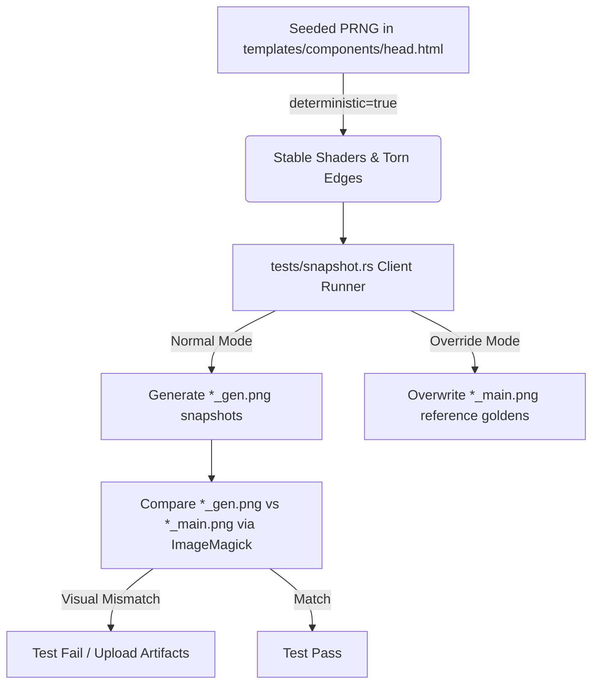

# Testing Corkboard

To maintain Corkboard's detailed skeuomorphic styling and layout, the project uses a visual regression testing suite (often called "golden tests"). This suite captures snapshots of individual UI components and page layouts, ensuring that changes (such as accessibility updates or stylesheet tweaks) do not break the design.

---

## How It Works

Visual regression tests compare the current rendering of the website against a set of "golden" reference images.



### 1. Deterministic Rendering

Skeuomorphic components (like WebGL paper grains and procedural torn paper edges) are generated using randomized noise. To make pixel-by-pixel image comparison possible, the template script overrides `Math.random()` with a seeded pseudo-random number generator (PRNG) when the query parameter `?deterministic=true` is present in the URL.

This locks down the visual noise patterns so they are identical across test runs.

### 2. Snapshot Generator (Rust)

A headless Chrome browser driver, located in [tests/snapshot.rs](file:///Users/gilnobrega/git/carbon/tests/snapshot.rs), is used to automatically load the pages and snapshot individual elements. It captures:
- Key global layouts (`header`, `#sidebar`, `footer`, `.article-card-wrapper`).
- Granular elements from the welcome article (`blockquote`, `table`, `pre` codeblocks, `.tipped-image-container` wrapper, `ul` lists, `hr` separators, and headings `h1` through `h6`).

---

## Running Tests Locally

### Prerequisite

Make sure the local development server is running in the background:

```bash
cargo run
```

### 1. Generate & Run Comparison Snapshots

Run the snapshot script to generate comparison files ending in `_gen.png` under `tests/golden/`:

```bash
cargo run --bin snapshot
```

### 2. Overwrite Golden Reference Images

If you have intentionally modified styling or layout elements and want to update the master reference images, use the `--override` flag to overwrite the `_main.png` files directly:

```bash
cargo run --bin snapshot -- --override
```

---

## Continuous Integration (CI)

Our GitHub Actions workflow ([visual-tests.yml](file:///Users/gilnobrega/git/carbon/.github/workflows/visual-tests.yml)) automatically runs the visual regression tests on every push and pull request.

1. Spawns the Corkboard server in the background.
2. Compiles and executes the `snapshot` runner to produce `_gen.png` images.
3. Compares all `_gen.png` against their `_main.png` counterparts using **ImageMagick**:
   ```bash
   compare -metric AE <main_file> <gen_file> <diff_file>
   ```
4. **Artifacts**: If tests fail, the visual diff file highlights mismatches in red and is uploaded as pipeline artifacts.
