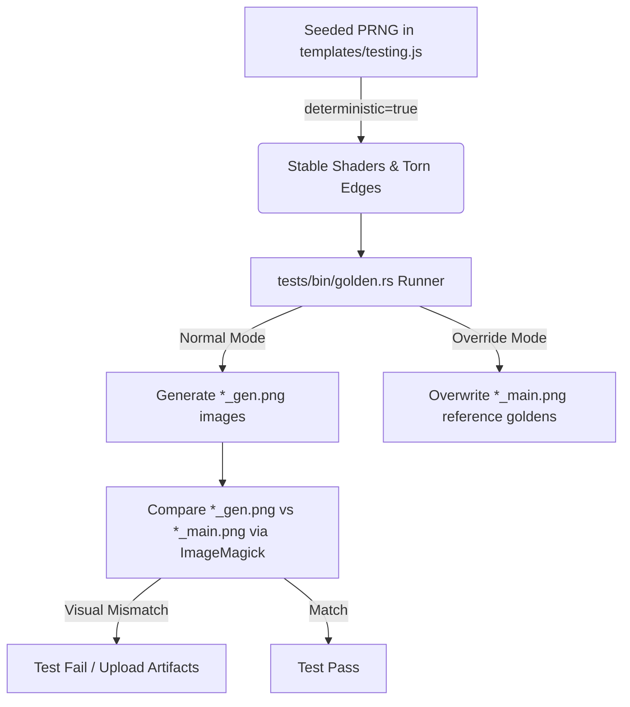

# Golden Tests

To maintain Corkboard's detailed skeuomorphic styling and layout, the project uses a golden testing suite. This suite captures golden images of individual UI components and page layouts, ensuring that changes (such as accessibility updates or stylesheet tweaks) do not break the design.

---

## How It Works

Golden tests compare the current rendering of the website against a set of "golden" reference images.



### 1. Deterministic Rendering

Skeuomorphic components (like WebGL paper grains and procedural torn paper edges) are generated using randomized noise. To make pixel-by-pixel image comparison possible, a testing helper script overrides `Math.random()` with a seeded pseudo-random number generator (PRNG) when the query parameter `?deterministic=true` is present in the URL.

This locks down the visual noise patterns so they are identical across test runs.

### 2. Golden Image Runner

A headless Chrome browser driver, located in [tests/bin/golden/main.rs](file:///Users/gilnobrega/git/carbon/tests/bin/golden/main.rs), is used to automatically load the pages and capture individual elements. It captures:
- Key global layouts (`header`, `#sidebar`, `footer`, `.article-card-wrapper`).
- Granular elements from the welcome article (`blockquote`, `table`, `pre` codeblocks, `.tipped-image-container` wrapper, `ul` lists, `hr` separators, and headings `h1` through `h6`).

---

## Running Tests Locally

### Prerequisite

Make sure the local development server is running in the background:

```bash
cargo run
```

### 1. Generate & Run Comparison Images

Run the golden test runner to generate comparison files ending in `_gen.png` under `tests/golden/`:

```bash
cargo run --bin golden
```

### 2. Overwrite Golden Reference Images

If you have intentionally modified styling or layout elements and want to update the master reference images, use the `--override` flag to overwrite the `_main.png` files directly:

```bash
cargo run --bin golden -- --override
```

---

## Continuous Integration (CI)

Our GitHub Actions workflow ([verify-goldens.yml](file:///Users/gilnobrega/git/carbon/.github/workflows/verify-goldens.yml)) automatically runs the golden tests on every push and pull request.

1. Spawns the Corkboard server in the background.
2. Compiles and executes the `golden` runner to produce `_gen.png` images.
3. Compares all `_gen.png` against their `_main.png` counterparts using **ImageMagick**:
   ```bash
   compare -metric AE -fuzz 1% <main_file> <gen_file> <diff_file>
   ```
4. **Tolerance**: The `1%` fuzz factor allows the suite to ignore subtle sub-pixel variations (such as minor rendering/image loading differences) while still catching actual layout regressions.
5. **Artifacts**: If tests fail, the visual diff files highlight mismatches in red and are uploaded as pipeline artifacts.

### Automatically Updating Reference Images on CI

Because rendering (such as font anti-aliasing and subpixel layouts) can differ slightly between your local operating system (e.g. macOS) and the Linux environment used by GitHub Actions, reference images should be generated on the CI runner to prevent OS-specific test failures.

You can trigger the **Update Golden Images** workflow on demand:

1. Push your code changes (which might affect UI rendering) to your branch on GitHub.
2. Go to the **Actions** tab in the repository.
3. Select the **Update Golden Images** workflow from the sidebar.
4. Click the **Run workflow** button, select your branch, and run it.
5. The workflow will run the suite in override mode (`--override`), regenerate the golden reference files (`*_main.png`), and commit/push them directly back to your branch.

